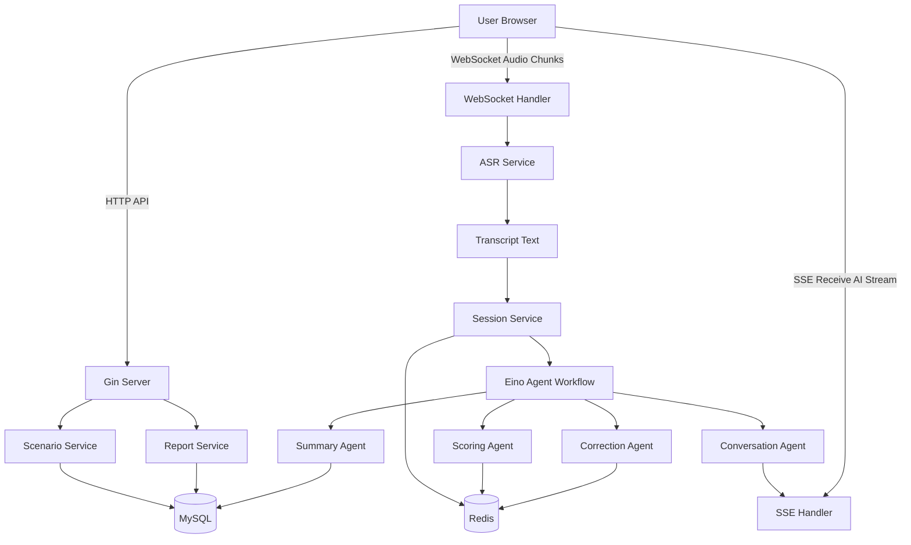
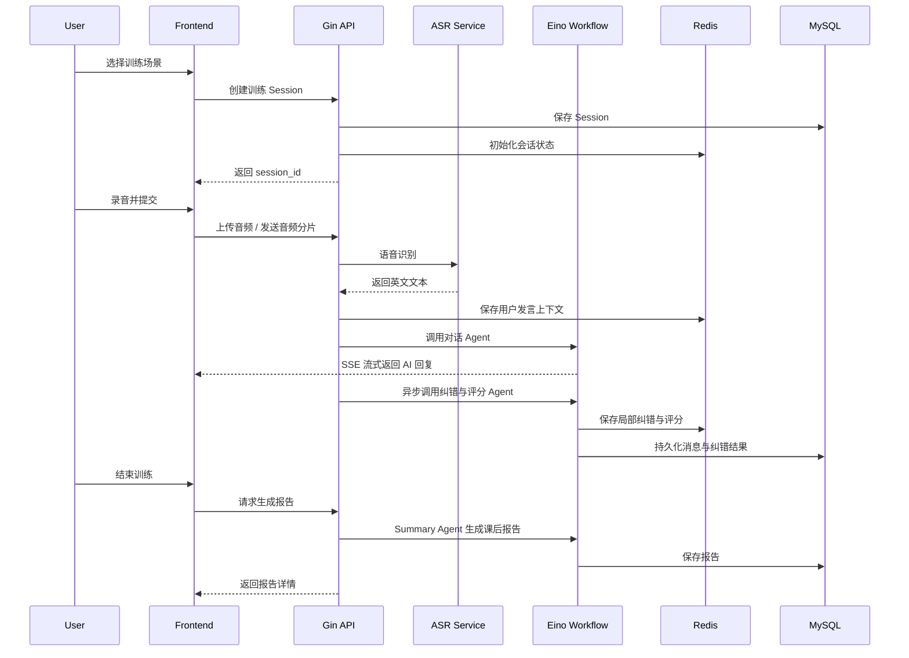

# SpeakMate AI

> 场景化 AI 英语口语陪练系统：通过语音对话、实时/异步纠错、多维度评分和课后总结，帮助用户在面试、点餐、会议等真实场景中提升英语表达能力。

`speakmate-ai` 是一个基于 **Go + Gin + Eino + MySQL + Redis + WebSocket/SSE** 构建的 AI 口语训练项目，面向七牛云 × XEngineer 暑期实训营第三批次「AI 英语口语陪练」议题设计。

本项目的目标不是简单做一个英语聊天机器人，而是构建一个完整的口语训练闭环：

```text
选择场景 → 语音对话 → AI 场景追问 → 表达纠错 → 能力评分 → 课后报告 → 下次练习建议
```

---

## 目录

- [项目背景](#项目背景)
- [核心功能](#核心功能)
- [功能完成情况](#功能完成情况)
- [技术栈](#技术栈)
- [系统架构](#系统架构)
- [核心流程](#核心流程)
- [Eino Agent 设计](#eino-agent-设计)
- [评分体系](#评分体系)
- [课后报告示例](#课后报告示例)
- [项目结构](#项目结构)
- [快速开始](#快速开始)
- [环境变量](#环境变量)
- [数据库设计](#数据库设计)
- [Redis 设计](#redis-设计)
- [接口设计](#接口设计)
- [WebSocket 协议](#websocket-协议)
- [SSE 流式输出](#sse-流式输出)
- [Prompt 设计](#prompt-设计)
- [Demo 演示建议](#demo-演示建议)
- [项目亮点](#项目亮点)
- [后续规划](#后续规划)
- [本地开发规范](#本地开发规范)
- [学术诚信与知识产权说明](#学术诚信与知识产权说明)
- [License](#license)

---

## 项目背景

很多英语学习者存在以下问题：

1. 缺少真实对话环境，长期停留在背单词、刷题阶段；
2. 和真人外教练习成本较高，且时间不灵活；
3. 普通 AI 聊天工具虽然可以对话，但缺少明确场景、学习目标和系统化反馈；
4. 口语训练后很难知道自己具体哪里有问题，也缺少可量化的提升路径。

因此，SpeakMate AI 试图解决的问题是：

> 如何让用户在真实场景中进行低压力、高频次、可反馈、可量化的英语口语训练？

本项目围绕「真实场景陪练」和「学习效果反馈」两个核心点展开，支持用户选择面试、点餐、会议等场景，与 AI 进行英语语音对话，并在训练结束后获得结构化学习报告。

---

## 核心功能

### 1. 场景化口语陪练

系统内置多个真实口语场景：

- 英语面试：自我介绍、项目经历、技术追问、行为面试；
- 餐厅点餐：询问菜单、表达偏好、处理特殊需求；
- 工作会议：表达观点、补充说明、澄清问题、总结结论。

每个场景包含：

- AI 角色设定；
- 用户训练目标；
- 难度等级；
- 对话开场白；
- 场景完成度评估规则。

### 2. 语音对话

用户可以通过浏览器录音进行英语表达，系统完成：

- 音频采集；
- 音频上传或分片传输；
- ASR 语音识别；
- AI 回复生成；
- SSE/WebSocket 流式返回。

为了保证 Demo 稳定性，项目建议支持两种模式：

| 模式 | 说明 | 适用场景 |
|---|---|---|
| 分段录音模式 | 用户按住说话，松开后上传音频识别 | 稳定演示、MVP 版本 |
| WebSocket 分片模式 | 前端持续发送音频分片，后端实时处理 | 加分项、低延迟体验 |

### 3. AI 场景追问

AI 不只是回答用户，而是根据场景目标主动推进对话。

例如在「英语面试」场景中，AI 会依次引导用户完成：

1. 自我介绍；
2. 项目经历描述；
3. 技术细节追问；
4. 团队协作或困难处理问题；
5. 结尾提问。

### 4. 语法与表达纠错

系统会分析用户发言，输出：

- 原始表达；
- 推荐表达；
- 错误类型；
- 中文解释；
- 更自然的表达建议。

示例：

```text
原句：I am study computer science and I have did a project about robot.

建议：I am studying computer science, and I have done a project on robot control.

问题：
- "am study" 应改为 "am studying"
- "have did" 应改为 "have done"
- "about robot" 更自然的表达是 "on robot control" 或 "about a robotics project"
```

### 5. 低打断式纠错

为了保证对话自然度，系统采用 **Delayed Correction** 策略：

- 对话过程中：右侧面板展示轻量纠错建议；
- AI 回复时：不频繁打断用户；
- 训练结束后：集中生成完整学习报告。

这样既能保持真实对话的连续性，又能让用户获得有效反馈。

### 6. 多维度能力评分

系统从多个维度评估用户口语能力：

- 流利度；
- 语法准确度；
- 表达自然度；
- 词汇丰富度；
- 场景完成度。

### 7. 课后总结报告

训练结束后，系统生成一份结构化报告，包括：

- 本次训练概览；
- 综合评分；
- 分项评分；
- 高频错误；
- 优化表达；
- 场景完成情况；
- 下次练习建议。

### 8. 历史训练记录

系统支持保存历史训练记录，便于用户查看长期变化：

- 每次训练场景；
- 训练时间；
- 对话轮次；
- 总分；
- 分项评分；
- 报告详情。

---

## 功能完成情况

> 提交前请根据实际开发进度更新本表。

| 模块 | 状态 | 说明 |
|---|---:|---|
| 场景选择 | ⬜ | 面试、点餐、会议等场景 |
| 文本对话 | ⬜ | 用户文本输入，AI 场景回复 |
| SSE 流式回复 | ⬜ | AI 回复逐字/逐句返回 |
| 语音录制 | ⬜ | 浏览器端录音 |
| ASR 语音识别 | ⬜ | 音频转文本 |
| WebSocket 音频传输 | ⬜ | 音频分片上传，可作为加分项 |
| 语法纠错 | ⬜ | 分析用户英文表达 |
| 表达优化 | ⬜ | 给出更自然的说法 |
| 多维度评分 | ⬜ | 流利度、语法、表达、词汇、完成度 |
| 课后总结报告 | ⬜ | 生成结构化学习报告 |
| 历史记录 | ⬜ | MySQL 持久化训练数据 |
| Demo 视频 | ⬜ | 3-5 分钟完整演示 |

状态说明：

- ✅ 已完成；
- 🚧 开发中；
- ⬜ 待完成。

---

## 技术栈

### 后端

| 技术 | 用途 |
|---|---|
| Go | 后端主语言 |
| Gin | HTTP API 服务 |
| Eino | LLM 应用编排、Agent 工作流 |
| MySQL | 用户、场景、训练记录、报告持久化 |
| Redis | 会话上下文、临时评分、WebSocket 状态缓存 |
| WebSocket | 语音分片传输、实时交互 |
| SSE | AI 回复流式输出 |
| GORM / sqlx | 数据访问层，可按项目实际选择 |

### AI 能力

| 能力 | 说明 |
|---|---|
| LLM 对话生成 | 根据场景生成 AI 回复和追问 |
| ASR | 将用户语音转为英文文本 |
| 纠错模型 | 分析语法、表达和用词问题 |
| 评分模型 | 根据 rubric 生成结构化评分 |
| TTS，可选 | 将 AI 回复转成语音播放 |

### 前端

前端技术不强制，可选择：

- Vue 3；
- React；
- 原生 HTML + JavaScript；
- Vite。

建议页面尽量简单稳定，重点突出核心闭环。

---

## 系统架构



整体设计思路：

1. Gin 提供 REST API、SSE 和 WebSocket 接口；
2. WebSocket 负责传输用户音频或实时交互事件；
3. ASR 模块将音频转换为文本；
4. Eino 编排多个 Agent，分别负责对话、纠错、评分和总结；
5. Redis 保存当前训练过程中的上下文与临时状态；
6. MySQL 保存长期数据，包括训练记录、消息、纠错结果和报告。

---

## 核心流程

### 训练主流程



### 单轮对话流程

```text
用户语音
  ↓
ASR 转文字
  ↓
保存用户发言
  ↓
Conversation Agent 生成 AI 回复
  ↓
SSE 流式返回
  ↓
Correction Agent 异步纠错
  ↓
Scoring Agent 更新局部评分
```

---

## Eino Agent 设计

本项目将 AI 能力拆成多个职责清晰的 Agent，而不是用一个 Prompt 完成所有任务。

### 1. Conversation Agent

职责：

- 扮演指定场景角色；
- 根据用户回答自然追问；
- 控制对话节奏；
- 推进场景目标；
- 避免频繁纠错打断用户。

输入：

```json
{
  "scenario": "interview",
  "ai_role": "technical interviewer",
  "user_goal": "complete a 5-minute English interview",
  "history": [],
  "user_message": "I am study computer science..."
}
```

输出：

```json
{
  "reply": "That sounds interesting. Could you tell me more about the project you worked on?",
  "stage": "project_experience",
  "next_goal": "ask user to describe personal contribution"
}
```

### 2. Correction Agent

职责：

- 检测语法错误；
- 优化表达；
- 给出简洁中文解释；
- 输出结构化 JSON，便于前端展示。

输出示例：

```json
{
  "original_text": "I am study computer science and I have did a project about robot.",
  "corrected_text": "I am studying computer science, and I have done a project on robot control.",
  "errors": [
    {
      "type": "grammar",
      "span": "am study",
      "suggestion": "am studying",
      "explanation": "be 动词后接现在分词，表示正在学习或当前状态。"
    },
    {
      "type": "grammar",
      "span": "have did",
      "suggestion": "have done",
      "explanation": "现在完成时应使用过去分词 done。"
    }
  ],
  "better_expressions": [
    "I major in computer science.",
    "I worked on a robotics project focused on motion control."
  ]
}
```

### 3. Scoring Agent

职责：

- 根据评分 rubric 输出分项分数；
- 给出评分原因；
- 生成用户可理解的建议。

输出示例：

```json
{
  "fluency_score": 75,
  "grammar_score": 72,
  "expression_score": 80,
  "vocabulary_score": 76,
  "completion_score": 85,
  "comment": "用户能够完成基本表达，但存在时态和搭配错误，项目描述还可以更具体。"
}
```

### 4. Summary Agent

职责：

- 汇总整场训练；
- 生成最终报告；
- 提炼高频错误；
- 给出下次练习建议。

输出示例见 [课后报告示例](#课后报告示例)。

---

## 评分体系

综合评分采用 100 分制。

```text
综合评分 =
0.25 × 流利度
+ 0.25 × 语法准确度
+ 0.20 × 表达自然度
+ 0.15 × 词汇丰富度
+ 0.15 × 场景完成度
```

### 分项解释

| 维度 | 权重 | 说明 |
|---|---:|---|
| 流利度 | 25% | 回答是否连贯，是否有大量停顿、重复、无意义填充词 |
| 语法准确度 | 25% | 时态、主谓一致、句法结构、介词搭配等是否准确 |
| 表达自然度 | 20% | 是否符合英语母语者常用表达习惯 |
| 词汇丰富度 | 15% | 是否过度依赖 simple words，是否有场景相关词汇 |
| 场景完成度 | 15% | 是否完成当前训练场景的核心任务 |

### 发音/流利度说明

如果当前版本没有接入专业音素级发音评测 API，则不要宣称支持精确音素评分。可以采用以下代理指标：

- ASR 识别置信度；
- 用户回答时长；
- 语速；
- 停顿次数；
- 重复词；
- filler words，例如 `uh`、`um`、`you know`。

README 和答辩中建议表述为：

> 当前版本使用 ASR 置信度、语速、停顿和重复词作为发音与流利度的代理指标。后续可接入专业 Pronunciation Assessment 能力，实现音素级发音评测。

---

## 课后报告示例

```json
{
  "session_id": "sess_20260605_001",
  "scenario": "英语面试",
  "duration_seconds": 272,
  "turn_count": 8,
  "user_message_count": 6,
  "total_score": 78,
  "scores": {
    "fluency": 75,
    "grammar": 72,
    "expression": 80,
    "vocabulary": 76,
    "completion": 85
  },
  "summary": "本次训练中，用户能够完成基本自我介绍和项目描述，整体表达意图清晰。但在时态、动词形式和项目经历的具体表达上仍有提升空间。",
  "major_problems": [
    "现在完成时使用不稳定，例如 have did 应改为 have done。",
    "部分表达偏中式，例如 make a project 可优化为 work on a project 或 build a project。",
    "项目经历描述不够具体，缺少背景、行动和结果。"
  ],
  "frequent_errors": [
    {
      "wrong": "I am study computer science",
      "correct": "I am studying computer science"
    },
    {
      "wrong": "I have did a project",
      "correct": "I have done a project"
    }
  ],
  "better_expressions": [
    "I major in computer science.",
    "I worked on a robotics project focused on motion control.",
    "My main responsibility was designing and implementing the backend service."
  ],
  "next_practice_plan": [
    "使用 STAR 法重新组织项目经历回答。",
    "练习 5 个技术项目介绍句式。",
    "复述本轮对话中系统给出的 3 个优化表达。"
  ]
}
```

---

## 项目结构

推荐目录结构如下：

```text
speakmate-ai/
├── cmd/
│   └── server/
│       └── main.go
├── internal/
│   ├── api/
│   │   ├── scenario_handler.go
│   │   ├── session_handler.go
│   │   ├── websocket_handler.go
│   │   ├── sse_handler.go
│   │   └── report_handler.go
│   ├── agent/
│   │   ├── conversation_agent.go
│   │   ├── correction_agent.go
│   │   ├── scoring_agent.go
│   │   ├── summary_agent.go
│   │   └── workflow.go
│   ├── asr/
│   │   ├── client.go
│   │   └── mock_client.go
│   ├── tts/
│   │   ├── client.go
│   │   └── mock_client.go
│   ├── config/
│   │   └── config.go
│   ├── middleware/
│   │   ├── cors.go
│   │   ├── logger.go
│   │   └── recovery.go
│   ├── model/
│   │   ├── user.go
│   │   ├── scenario.go
│   │   ├── session.go
│   │   ├── message.go
│   │   ├── correction.go
│   │   └── report.go
│   ├── repository/
│   │   ├── scenario_repo.go
│   │   ├── session_repo.go
│   │   ├── message_repo.go
│   │   ├── correction_repo.go
│   │   └── report_repo.go
│   ├── service/
│   │   ├── scenario_service.go
│   │   ├── session_service.go
│   │   ├── voice_service.go
│   │   ├── correction_service.go
│   │   └── report_service.go
│   └── pkg/
│       ├── response/
│       ├── errors/
│       └── utils/
├── web/
│   ├── index.html
│   ├── src/
│   └── package.json
├── migrations/
│   ├── 001_init.sql
│   └── 002_seed_scenarios.sql
├── docs/
│   ├── architecture.md
│   ├── api.md
│   ├── prompt.md
│   └── demo-script.md
├── scripts/
│   ├── run-dev.sh
│   └── migrate.sh
├── docker-compose.yml
├── Dockerfile
├── go.mod
├── go.sum
├── .env.example
└── README.md
```

---

## 快速开始

### 1. 克隆项目

```bash
git clone https://github.com/<your-username>/speakmate-ai.git
cd speakmate-ai
```

### 2. 准备环境变量

```bash
cp .env.example .env
```

然后编辑 `.env`，填写数据库、Redis、模型和 ASR 配置。

### 3. 启动 MySQL 和 Redis

如果项目提供 `docker-compose.yml`：

```bash
docker compose up -d mysql redis
```

### 4. 初始化数据库

```bash
bash scripts/migrate.sh
```

或者手动执行：

```bash
mysql -u root -p speakmate < migrations/001_init.sql
mysql -u root -p speakmate < migrations/002_seed_scenarios.sql
```

### 5. 启动后端服务

```bash
go mod tidy
go run ./cmd/server
```

默认服务地址：

```text
http://localhost:8080
```

### 6. 启动前端

如果使用 Vite：

```bash
cd web
npm install
npm run dev
```

默认前端地址：

```text
http://localhost:5173
```

---

## 环境变量

`.env.example` 示例：

```env
# Server
APP_NAME=SpeakMateAI
APP_ENV=dev
APP_PORT=8080
APP_DEBUG=true

# MySQL
MYSQL_HOST=127.0.0.1
MYSQL_PORT=3306
MYSQL_USER=root
MYSQL_PASSWORD=123456
MYSQL_DATABASE=speakmate

# Redis
REDIS_ADDR=127.0.0.1:6379
REDIS_PASSWORD=
REDIS_DB=0

# LLM
LLM_PROVIDER=openai-compatible
LLM_BASE_URL=https://api.example.com/v1
LLM_API_KEY=replace-with-your-api-key
LLM_MODEL=replace-with-your-model

# ASR
ASR_PROVIDER=mock
ASR_BASE_URL=
ASR_API_KEY=
ASR_MODEL=

# TTS Optional
TTS_PROVIDER=mock
TTS_BASE_URL=
TTS_API_KEY=
TTS_MODEL=

# Storage Optional
STORAGE_PROVIDER=local
STORAGE_LOCAL_DIR=./storage
```

说明：

- `ASR_PROVIDER=mock` 时，可用于本地开发和无语音能力时的调试；
- `TTS_PROVIDER=mock` 时，AI 回复只返回文本，不生成语音；
- 提交项目时不要将真实 API Key 提交到 GitHub。

---

## 数据库设计

### users

```sql
CREATE TABLE users (
    id BIGINT PRIMARY KEY AUTO_INCREMENT,
    username VARCHAR(64) NOT NULL,
    created_at DATETIME NOT NULL DEFAULT CURRENT_TIMESTAMP,
    updated_at DATETIME NOT NULL DEFAULT CURRENT_TIMESTAMP ON UPDATE CURRENT_TIMESTAMP
);
```

### scenarios

```sql
CREATE TABLE scenarios (
    id BIGINT PRIMARY KEY AUTO_INCREMENT,
    name VARCHAR(64) NOT NULL,
    code VARCHAR(64) NOT NULL UNIQUE,
    description TEXT,
    ai_role TEXT,
    user_goal TEXT,
    difficulty VARCHAR(32),
    opening_prompt TEXT,
    rubric JSON,
    created_at DATETIME NOT NULL DEFAULT CURRENT_TIMESTAMP,
    updated_at DATETIME NOT NULL DEFAULT CURRENT_TIMESTAMP ON UPDATE CURRENT_TIMESTAMP
);
```

### training_sessions

```sql
CREATE TABLE training_sessions (
    id BIGINT PRIMARY KEY AUTO_INCREMENT,
    session_no VARCHAR(64) NOT NULL UNIQUE,
    user_id BIGINT NOT NULL,
    scenario_id BIGINT NOT NULL,
    status VARCHAR(32) NOT NULL DEFAULT 'created',
    started_at DATETIME,
    ended_at DATETIME,
    duration_seconds INT DEFAULT 0,
    total_score INT DEFAULT 0,
    fluency_score INT DEFAULT 0,
    grammar_score INT DEFAULT 0,
    expression_score INT DEFAULT 0,
    vocabulary_score INT DEFAULT 0,
    completion_score INT DEFAULT 0,
    summary TEXT,
    created_at DATETIME NOT NULL DEFAULT CURRENT_TIMESTAMP,
    updated_at DATETIME NOT NULL DEFAULT CURRENT_TIMESTAMP ON UPDATE CURRENT_TIMESTAMP,
    INDEX idx_user_id (user_id),
    INDEX idx_scenario_id (scenario_id),
    INDEX idx_session_no (session_no)
);
```

### messages

```sql
CREATE TABLE messages (
    id BIGINT PRIMARY KEY AUTO_INCREMENT,
    session_id BIGINT NOT NULL,
    role VARCHAR(32) NOT NULL,
    content TEXT NOT NULL,
    audio_url VARCHAR(512),
    asr_confidence DECIMAL(5, 4),
    duration_ms INT DEFAULT 0,
    created_at DATETIME NOT NULL DEFAULT CURRENT_TIMESTAMP,
    INDEX idx_session_id (session_id)
);
```

### corrections

```sql
CREATE TABLE corrections (
    id BIGINT PRIMARY KEY AUTO_INCREMENT,
    session_id BIGINT NOT NULL,
    message_id BIGINT NOT NULL,
    original_text TEXT NOT NULL,
    corrected_text TEXT,
    error_type VARCHAR(64),
    explanation TEXT,
    suggestion TEXT,
    correction_json JSON,
    created_at DATETIME NOT NULL DEFAULT CURRENT_TIMESTAMP,
    INDEX idx_session_id (session_id),
    INDEX idx_message_id (message_id)
);
```

### reports

```sql
CREATE TABLE reports (
    id BIGINT PRIMARY KEY AUTO_INCREMENT,
    session_id BIGINT NOT NULL,
    report_json JSON NOT NULL,
    created_at DATETIME NOT NULL DEFAULT CURRENT_TIMESTAMP,
    updated_at DATETIME NOT NULL DEFAULT CURRENT_TIMESTAMP ON UPDATE CURRENT_TIMESTAMP,
    UNIQUE KEY uk_session_id (session_id)
);
```

---

## Redis 设计

Redis 用于保存实时训练状态，不作为长期存储。

| Key | 类型 | 说明 | TTL |
|---|---|---|---:|
| `session:{sessionId}:messages` | List | 当前训练对话上下文 | 2h |
| `session:{sessionId}:state` | Hash | 当前阶段、场景目标、轮次数 | 2h |
| `session:{sessionId}:partial_score` | Hash | 实时分项评分 | 2h |
| `session:{sessionId}:corrections` | List | 临时纠错结果 | 2h |
| `ws:{userId}:connection` | String | WebSocket 连接状态 | 30m |

示例：

```text
session:10001:state
- scenario_code = interview
- current_stage = project_experience
- turn_count = 4
- status = running
```

---

## 接口设计

### 场景接口

#### 获取场景列表

```http
GET /api/v1/scenarios
```

响应：

```json
{
  "code": 0,
  "message": "success",
  "data": [
    {
      "id": 1,
      "code": "interview",
      "name": "英语面试",
      "description": "模拟外企技术面试场景",
      "difficulty": "medium"
    }
  ]
}
```

#### 获取场景详情

```http
GET /api/v1/scenarios/:id
```

---

### 训练 Session 接口

#### 创建训练 Session

```http
POST /api/v1/sessions
Content-Type: application/json
```

请求：

```json
{
  "user_id": 1,
  "scenario_id": 1
}
```

响应：

```json
{
  "code": 0,
  "message": "success",
  "data": {
    "session_id": 10001,
    "session_no": "sess_20260605_10001",
    "opening_message": "Welcome to the interview. Could you briefly introduce yourself?"
  }
}
```

#### 发送文本消息

```http
POST /api/v1/sessions/:session_id/messages
Content-Type: application/json
```

请求：

```json
{
  "content": "I am studying computer science and I worked on a robot project."
}
```

响应：

```json
{
  "code": 0,
  "message": "success",
  "data": {
    "message_id": 20001,
    "reply": "That sounds interesting. Could you tell me what your main responsibility was in that project?"
  }
}
```

#### 结束训练

```http
POST /api/v1/sessions/:session_id/finish
```

响应：

```json
{
  "code": 0,
  "message": "success",
  "data": {
    "session_id": 10001,
    "status": "finished"
  }
}
```

---

### 语音接口

#### 上传单段录音

```http
POST /api/v1/sessions/:session_id/audio
Content-Type: multipart/form-data
```

参数：

| 字段 | 类型 | 必填 | 说明 |
|---|---|---:|---|
| audio | file | 是 | 用户录音文件 |

响应：

```json
{
  "code": 0,
  "message": "success",
  "data": {
    "transcript": "I am studying computer science.",
    "asr_confidence": 0.92,
    "message_id": 20001
  }
}
```

---

### 纠错接口

#### 获取单条消息纠错结果

```http
GET /api/v1/messages/:message_id/corrections
```

#### 获取训练中的全部纠错结果

```http
GET /api/v1/sessions/:session_id/corrections
```

---

### 报告接口

#### 生成课后报告

```http
POST /api/v1/sessions/:session_id/report
```

#### 获取课后报告

```http
GET /api/v1/sessions/:session_id/report
```

---

## WebSocket 协议

WebSocket 地址：

```text
ws://localhost:8080/ws/v1/sessions/{session_id}/audio
```

### 客户端发送事件

#### start

```json
{
  "type": "start",
  "payload": {
    "format": "webm",
    "sample_rate": 16000
  }
}
```

#### audio_chunk

音频分片可以使用二进制帧，也可以使用 Base64 JSON 包装。

```json
{
  "type": "audio_chunk",
  "payload": {
    "seq": 1,
    "data": "base64-audio-data"
  }
}
```

#### end

```json
{
  "type": "end",
  "payload": {
    "last_seq": 12
  }
}
```

### 服务端返回事件

#### partial_transcript

```json
{
  "type": "partial_transcript",
  "payload": {
    "text": "I am studying...",
    "is_final": false
  }
}
```

#### final_transcript

```json
{
  "type": "final_transcript",
  "payload": {
    "text": "I am studying computer science.",
    "confidence": 0.92
  }
}
```

#### correction

```json
{
  "type": "correction",
  "payload": {
    "original_text": "I have did a project.",
    "corrected_text": "I have done a project.",
    "errors": []
  }
}
```

---

## SSE 流式输出

SSE 地址：

```http
GET /api/v1/sessions/:session_id/stream
```

### 事件类型

#### ai_message_delta

```text
event: ai_message_delta
data: {"content":"That sounds"}
```

#### ai_message_done

```text
event: ai_message_done
data: {"message_id":20002}
```

#### correction_done

```text
event: correction_done
data: {"message_id":20001,"has_errors":true}
```

#### score_updated

```text
event: score_updated
data: {"fluency":75,"grammar":72}
```

---

## Prompt 设计

### Conversation Agent Prompt 示例

```text
你是 SpeakMate AI 的英语口语陪练 Agent。

当前场景：{{scenario_name}}
你的角色：{{ai_role}}
用户目标：{{user_goal}}
当前阶段：{{stage}}

要求：
1. 你必须使用英文与用户对话。
2. 每次回复控制在 1-3 句话，避免过长。
3. 不要频繁纠正用户错误，优先保持真实对话流畅性。
4. 根据场景目标主动追问，引导用户完成训练任务。
5. 如果用户表达不完整，可以用自然方式继续追问。
6. 不要切换到中文，除非系统明确要求生成报告或解释。

用户上一句话：{{user_message}}
对话历史：{{history}}
```

### Correction Agent Prompt 示例

```text
你是英语口语表达纠错专家。

请分析用户的英文表达，输出严格 JSON，不要输出 Markdown。

分析维度：
1. grammar：语法错误
2. vocabulary：用词错误或不自然
3. expression：表达不地道
4. structure：句子结构问题

要求：
- 不要过度纠错，保留用户原意。
- 解释用中文，推荐表达用英文。
- 每条错误必须包含 type、span、suggestion、explanation。

用户原句：{{user_message}}
```

### Scoring Agent Prompt 示例

```text
你是英语口语能力评估专家。

请根据用户在当前场景下的表达，从以下维度打分：
- fluency_score：流利度，0-100
- grammar_score：语法准确度，0-100
- expression_score：表达自然度，0-100
- vocabulary_score：词汇丰富度，0-100
- completion_score：场景完成度，0-100

请输出严格 JSON，不要输出 Markdown。

评分时请参考：
1. 用户是否清楚表达核心意思；
2. 是否存在明显语法错误；
3. 是否符合当前场景；
4. 是否有更自然的表达方式；
5. 是否完成当前训练阶段目标。

当前场景：{{scenario_name}}
当前阶段：{{stage}}
用户表达：{{user_message}}
纠错结果：{{correction_result}}
```

### Summary Agent Prompt 示例

```text
你是 SpeakMate AI 的课后总结 Agent。

请根据整场训练对话、纠错结果和评分记录，生成中文学习报告。

报告必须包含：
1. 本次训练概览；
2. 综合评分；
3. 分项评分；
4. 主要问题；
5. 高频错误；
6. 更自然表达；
7. 下次练习建议。

请输出严格 JSON，不要输出 Markdown。

训练场景：{{scenario_name}}
对话历史：{{history}}
纠错记录：{{corrections}}
评分记录：{{scores}}
```

---

## Demo 演示建议

建议使用「英语面试」场景作为主 Demo。

### 演示脚本

```text
0:00 - 0:20 介绍项目背景
0:20 - 0:45 展示系统架构
0:45 - 1:10 选择英语面试场景
1:10 - 2:20 进行语音对话
2:20 - 2:50 展示实时/异步纠错
2:50 - 3:40 结束训练并生成课后报告
3:40 - 4:20 展示历史记录和评分维度
4:20 - 4:50 总结技术亮点
```

### 推荐演示输入

可以故意说一句带有错误的英文，方便展示纠错效果：

```text
I am study computer science, and I have did a project about robot control.
```

系统应识别并纠正为：

```text
I am studying computer science, and I have done a project on robot control.
```

### Demo 重点

演示时重点突出：

1. 不是普通聊天，而是场景化训练；
2. AI 会主动追问，推动训练目标；
3. 纠错不会频繁打断对话；
4. 课后报告可量化；
5. Go + Gin + Eino + Redis + MySQL 的工程架构清晰。

---

## 项目亮点

### 1. 场景目标驱动的对话设计

系统不是开放闲聊，而是围绕具体场景目标推进训练。例如面试场景会引导用户完成自我介绍、项目描述、技术追问和结尾提问。

### 2. 低打断式纠错体验

传统纠错容易打断用户表达，本项目采用对话中轻量提示、课后集中总结的方式，在自然度和学习效果之间取得平衡。

### 3. 多 Agent 分工

使用 Eino 将复杂任务拆分为：

- Conversation Agent；
- Correction Agent；
- Scoring Agent；
- Summary Agent。

这种设计便于扩展和替换模型，也更容易解释系统内部逻辑。

### 4. 多维度量化反馈

系统不只给出“说得不错”这种泛泛评价，而是从流利度、语法、表达、词汇和场景完成度进行结构化评分。

### 5. 实时交互架构

结合 WebSocket 与 SSE：

- WebSocket 用于音频分片和实时交互；
- SSE 用于 AI 回复流式输出；
- Redis 用于维护当前训练上下文；
- MySQL 用于保存长期训练记录。

---

## 后续规划

### 短期优化

- 接入更稳定的 ASR 服务；
- 支持 AI 语音回复；
- 优化前端交互体验；
- 增加更多训练场景；
- 支持报告导出。

### 中期优化

- 接入专业发音评测能力；
- 支持用户长期能力趋势图；
- 针对薄弱项自动生成专项练习；
- 支持自定义场景；
- 支持多模型切换。

### 长期规划

- 个性化学习路径；
- 多人会议口语模拟；
- 企业面试专项训练；
- 移动端适配；
- 更细粒度的音素级发音反馈。

---

## 本地开发规范

### Go 代码格式化

```bash
gofmt -w .
```

### 运行测试

```bash
go test ./...
```

### 提交规范

建议使用以下 commit 风格：

```text
feat: add scenario selection api
fix: resolve websocket close error
docs: update README
refactor: split correction agent
```

### 分支建议

```text
main        # 稳定分支
dev         # 开发分支
feature/*   # 功能分支
```

---

## 学术诚信与知识产权说明

本项目为七牛云 × XEngineer 暑期实训营作品，遵守以下原则：

1. 项目代码由提交者独立完成或在队伍内协作完成；
2. 使用第三方开源库时遵守对应 License；
3. 不提交真实 API Key、密钥、账号密码等敏感信息；
4. 不上传未经授权的音频、文本或其他受版权保护的数据；
5. 如使用外部模型、ASR、TTS 或云服务，在文档中明确说明其用途。

---

## License

本项目可根据实际情况选择开源协议。

推荐：

```text
MIT License
```

如果暂时不确定是否开源，可以先不添加 License 文件，并在提交前根据团队策略决定。

---

## 致谢

感谢七牛云 × XEngineer 暑期实训营提供的实战议题。本项目围绕 AI 英语口语陪练场景进行设计与实现，目标是在有限时间内完成一个稳定、可演示、可扩展的 AI 应用原型。
